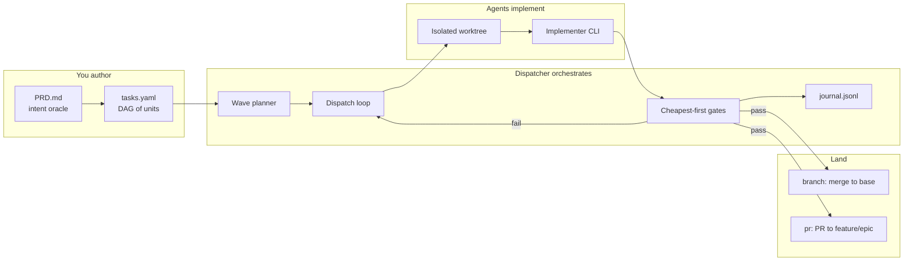
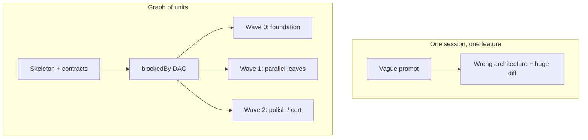
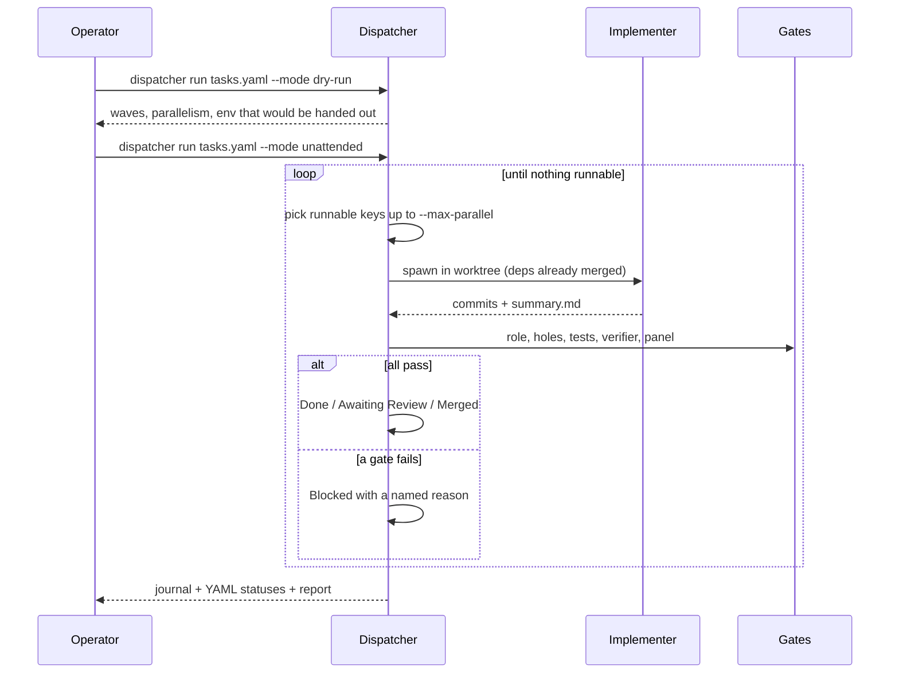

# Onboarding — Claude Dispatcher

The dispatcher runs a **feature as a graph of tasks** across isolated agent
sessions. You author the graph; the dispatcher owns the loop (who runs, in
what order, against which tree, and whether the result is allowed to land).

This folder is the first read. The rest of `docs/` and the root `README.md`
are reference.

| If you want… | Read |
|---|---|
| A 5-minute mental model | this page |
| Architecture, waves, per-task pipeline | [how-it-works.md](./how-it-works.md) |
| Why the design looks like this | [why-it-works.md](./why-it-works.md) |
| Install, first run, observe, unblock | [how-to-use.md](./how-to-use.md) |
| Data model → load against Postgres/NATS → *then* the graph | [design-loop.md](./design-loop.md) |
| Author a `tasks.yaml` / PRD | [../how-to-author-tasks.md](../how-to-author-tasks.md) |
| Wire a product repo | [../new-project-setup.md](../new-project-setup.md) |
| Machine install | [../../SETUP.md](../../SETUP.md) |
| CLI flags and schemas | [../../README.md](../../README.md) |
| Map of every doc | [../README.md](../README.md) |

---

## What it is

A `tasks.yaml` is a DAG. Each node is one mergeable unit of work. The
dispatcher:

1. Computes **waves** from `blockedBy` (independent tasks run in parallel).
2. Gives each task (or batch) its own **git worktree and branch**.
3. Spawns an **implementer agent** as a worker — not an orchestrator.
4. Runs a **cheapest-first gate stack** (diff policy → tests → spec check →
   cross-family review).
5. Lands the result (`branch` merge or `pr` onto a feature branch) and writes
   a **hash-chained journal** so the run is reconstructable.

The one-line contract: **the dispatcher is the only orchestrator; agents
write code.** See [architecture/single-orchestrator.md](../architecture/single-orchestrator.md).

---

## Why a graph, not one long session

A single agent session on a whole feature fails in two expensive ways:

- **Unreviewable volume** — thousands of lines, no seam, you cannot honestly
  sign the diff.
- **Architecture thrash** — a long unattended run reverse-engineers an
  implicit design *wrong* and spirals for hours.

The graph is the fix. A human (or a strong planner) authors the **skeleton
and the seams**; agents fill **bounded bodies** against those contracts, in
parallel, each in a clean context. You review the skeleton and the
deviations, not every conforming body.

The longer argument — including deviations, the role split, and the scars
that produced them — is [why-it-works.md](./why-it-works.md).

---

## The smallest picture of a run

---

## Three roles you will play

| Role | Job | Do not |
|---|---|---|
| **Planner** | PRD + skeleton + `tasks.yaml` with real `blockedBy`. For money / session / board work the skeleton is the output of [design-loop.md](./design-loop.md), not a prose PRD. | Implement product code in the same pass |
| **Operator** | Dry-run, dispatch, watch, unblock, land | Hand-edit YAML statuses to “make it green” |
| **Implementer** (the agent) | Fill the task in CWD, commit, write `summary.md` | Adopt Tasker, open PRs, re-plan the epic |

The planner prompt lives at [templates/planner-prompt.md](../templates/planner-prompt.md).

---

## Next

1. [How it works](./how-it-works.md) — the graph, the loop, the gates.
2. [Why it works](./why-it-works.md) — the bets and the scars.
3. [How to use it](./how-to-use.md) — a first run you can trust.
