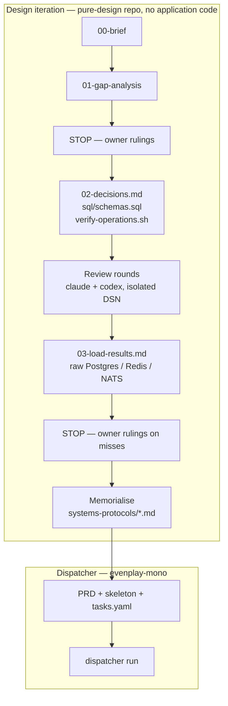
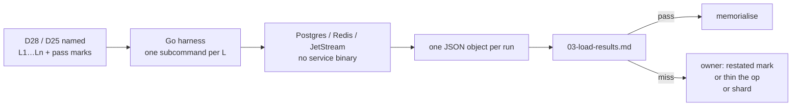

# Before the graph — data model, contracts, load

The dispatcher implements a graph. **This page is the work that produces the
graph**: a data model and contracts, proven against a raw store at the
volumes the brief named, then memorialised. Only then does `tasks.yaml`
exist as something a planner can derive rather than invent.

This is **not** `dispatcher run`, and it is not
`--enable-design-stage` (that is a per-task sketch before one implementer
spawn). Mixing the two is how you get thirteen design-review rounds billed
as implementer tasks with no stop rule.

The loop already lives in the sibling clone
`claude-workflow/skills/design-iteration.md`. Worked examples:
`ep2.0/leaderboard/` (first under the skill), `ep2.0/bay-session/`
(second), `ep2.0/wallet/` (contracts + suite; load was deferred — see
below).

---

## Should this be captured?

**Yes, as its own phase.** The dispatcher onboarding used to start at
`tasks.yaml` as if the skeleton appeared. For wallet / bay-session /
leaderboard, the expensive work is *settling the model* so later agents
fill bodies against something that has already survived review and load.

Do **not** fold it into the implementer loop. Different isolation, different
seats, different stop rule, different definition of done.



Two owner stops, both mandatory. Everything between them is mechanical.
Wallet and leaderboard both changed direction at a stop; skipping one
because the answer “seems obvious” is the failure mode the skill names.

---

## What the three designs actually did

| | Wallet | Leaderboard | Bay session |
|---|---|---|---|
| Shape | PRD + `systems-protocols/wallet.md` + SQL + suite | Full skill loop, 13 rounds | Full skill loop, 20+ rounds, then cloud RDS vs Aurora |
| Suite | `verify-operations.sh` | 336 ops, 90 mutants, concurrent section | 383 passes on rev 7.18; registry + mutants + census |
| Load in the design repo | **None.** Marks live as a withheld oracle for the *implementation* (`studies/wallet-oracle/LOAD.md`) | Redis + Postgres via `lbload` (fun / audited / snapshot) | Postgres via `bayload` (station / fleet / selection / recovery / sweeper / fence) |
| NATS | out of model (wallet is called, not subscribed) | named as the ingest; **not harnessed** — a 2026-05 in-process publish-only number (~44k–154k ev/s) is cited in the gap analysis as “floor-of-the-floor” | NATS is an operating choice; the model is inbox/outbox SQL |
| What load changed | n/a here | two defects the 336-op suite could not see (monotone timestamp under lock wait; void rebuilding the board under the lock) → D20, D23 | two **missed marks** (L3 arm 6.8 vs 5 ms; L5 sweeper 42 s vs 30 s) that became *rulings*, not table changes; fence held over 6M transitions |

The pattern that is worth capturing:

1. **Name the measurements in the decisions before any number exists**, with
   pass marks. A failed measurement changes numbers, not tables.
2. **Drive the model through the suite’s reference operations**, constraints
   and registry guard **armed**. A shortcut measures a different system.
3. **Report where it broke, at what volume, and what was not measured**, per
   store. Silence is a hole a later implementer will invent a number for.
4. **Then move on.** Memorialise. The graph in `evenplay-mono` is built
   *from* this folder; this folder stays the authority.



---

## How this feeds a dispatcher run

What the planner inherits, if the design loop actually finished:

| Design artefact | Becomes |
|---|---|
| `sql/schemas.sql` + generated `dbdoc/` | skeleton tables, types, CHECKs — wave 0 |
| `02-decisions.md` | `blockedBy` edges and out-of-scope lines |
| `verify-operations.sh` titles | seals: one row per invariant / refusal / mutant class |
| `03-load-results.md` pass marks | a later `role: load` task, or a withheld oracle the implementation must clear without having seen |
| `systems-protocols/*.md` | the PRD / intent oracle `--feature-review` reads |

If those are missing, a planner inventing `tasks.yaml` from a prose PRD is
doing the design loop in disguise, badly.

---

## Tools — already there

Do not rebuild these. Copy them.

| Tool | Where | Job |
|---|---|---|
| Design-iteration skill | `claude-workflow/skills/design-iteration.md` | the sequence, seats, two-round stop, claims ledger, metrics |
| Suite template | `claude-workflow/templates/conformance-suite/` | `verify-operations.sh` helpers, `check-claims.py`, `round-metrics.py`, `load-harness.md` |
| Design-reviewer role | `claude-workflow/roles/design-reviewer.md` | six dimensions, BLOCKING/MAJOR/MINOR |
| `tbls` | `go install github.com/k1LoW/tbls@latest` | `docs/dbdoc/` from a loaded schema |
| `bayload` / `lbload` | `ep2.0/{bay-session,leaderboard}/load/` | the harness shape to copy: `hist`, JSON stdout, one subcommand per named measurement |
| Isolated DSN per seat | skill rule | a reviewer that writes the suite or shares an estate is withdrawn |

`dispatcher doctor` does not probe Postgres/Redis/NATS. A design machine
needs those beside the agent CLIs.

---

## Tools worth adding — only if the next design would hurt without them

Ranked by how much the last three designs actually paid.

### 1. A shared load kit (small, high leverage)

Leaderboard and bay-session each hand-rolled a ~500-line Go `main.go`. The
rules in `load-harness.md` are shared; the code is not. A `loadkit` package
(histogram + percentiles, JSON emit, estate-not-timed, pass-mark compare,
exit 0/1) would have saved the “six harness iterations before the first
number” the skill already records.

Do **not** wrap this in k6/locust over HTTP. These designs are proven
against **SQL functions, Redis commands, and (should you add it) JetStream
subjects** — not a service binary that does not exist yet.

### 2. `load-marks.yaml` as a mechanical gate

Today pass/fail is a human copying JSON into `03-load-results.md`. A file
the harness reads:

```yaml
# fragment: named measurements the decisions already committed to
marks:
  - id: L1
    command: [station, -sims, "8", -shots, "100", -rate, "10"]
    p99_ms: { path: decision_p99_ms, max: 50 }
    extra: { counted_eq_arms: true }
  - id: L6
    command: [fence]
    violations: 0
```

Then a dispatcher row can be `verify: mechanical` against that command.
Misses still need an **owner ruling** (bay-session L3/L5): the gate reports
the miss; it does not restated the mark.

### 3. A named design-estate compose

Harnesses currently assume ad-hoc ports (`ep2-lb-pg` on 55470, Redis on
56379, “postgres:postgres@localhost”). A single compose — Postgres 16,
Redis 7, **nats-server with JetStream** — with documented DSNs would make
“raw database / NATS” a checkout step instead of folklore. Review seats
already need their own snapshot; the compose should be able to stamp out
N isolated DSNs.

### 4. A NATS / JetStream harness (the actual gap)

NATS is in the **contracts** (leaderboard ingest, bay-session operating
notes) and almost nowhere in the **numbers**.

What exists: one 2026-05 in-process publish-only figure, no consumer, no
apply, no ranking. `nats bench` will reproduce that and still not answer
whether the model’s outbox → JetStream → apply path holds at the fleet
rate, what the ack-wait must be (leaderboard copies it onto a Redis TTL),
or what a redelivery does to idempotency.

A `natsload` subcommand in the same Go program, publishing the **model’s
event shape** (not `"foo"`), with a durable consumer that calls the same
reference operations the suite installed, is the missing measurement.
Until it exists, “load test against NATS” is a publish benchmark, which
the gap analysis already called out as not a leaderboard number.

### 5. Do **not** add yet: `dispatcher design-run`

Orchestrating the review rounds (isolated worktrees, per-seat DSN, claims
ledger, two-round stop, `metrics.jsonl`) is tempting. The leaderboard paid
13 rounds of this **by hand** and the skill already encodes the rules.

Build a dispatcher subcommand only when the next design’s operator time is
the bottleneck, not the model. A bad automation will skip a stop or share
an estate — both already happened once with a human in the loop. The
skill’s “seat that writes the repo is withdrawn” rule is easier to break
in software than to keep.

`--enable-design-stage` stays what it is: a short per-task sketch. Do not
point it at `02-decisions.md`.

### 6. Optional later: `role: load` on the implementation graph

After memorialising, the *implementation* still has to clear the same
marks (wallet v2’s withheld WL1–WL8 are this). A task whose `test:` is
the harness, with the marks file, is a real mechanical gate. Keep the
marks **out of the implementer’s prompt** if you want “holds up under
load it was never shown” to stay a real question — same reason
`studies/wallet-oracle/` is not in `ep2.0`.

---

## What not to do

| Temptation | Why it fails |
|---|---|
| Start `tasks.yaml` from a prose PRD for a money/session/board service | You are in the design loop whether you admit it or not |
| Load-test the future HTTP API | There is no service yet; you will measure a stub |
| Disarm CHECKs / the registry guard “just for load” | You measured a different model; bay-session and leaderboard both forbade this |
| Treat a missed mark as a failed implementer task | L3/L5 were owner rulings on the *mark* |
| Share one database across review seats | A seat injected debug lines into the suite and ran it under other seats’ probes |
| Count NATS publish/s as “the leaderboard holds” | Already written down as not that |

---

## Operator checklist for the next service

1. New folder in the pure-design repo, copy the suite template, write
   `00-brief.md`.
2. Gap analysis, **stop**, rulings.
3. Decisions + SQL + suite green twice on two Postgres majors if you
   deploy on more than one.
4. Review rounds until the stop rule (two consecutive clean, one of them a
   full re-audit).
5. Load: named marks, raw stores, JSON, `03-load-results.md`, **stop**.
6. Memorialise. Then — and only then — a planner writes `tasks.yaml` for
   `evenplay-mono` from those artefacts.

The dispatcher’s job begins at step 6.
