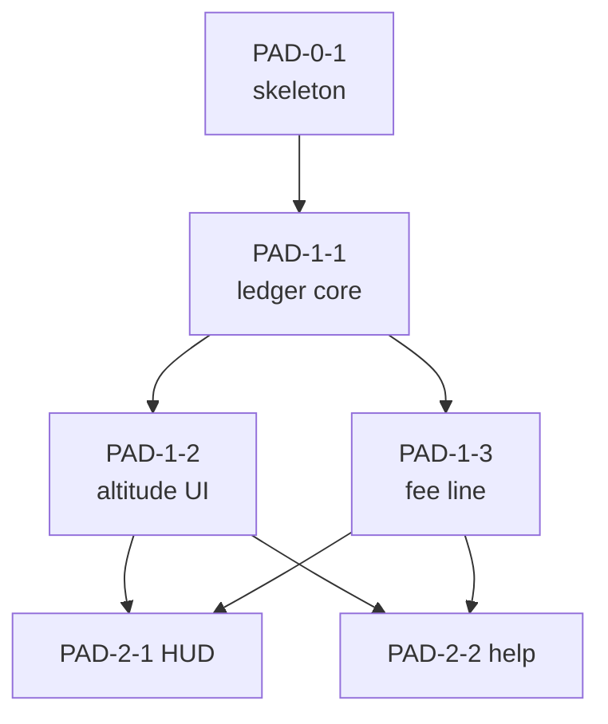
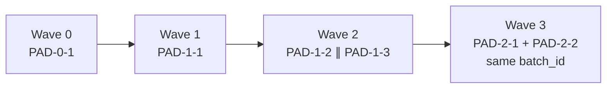
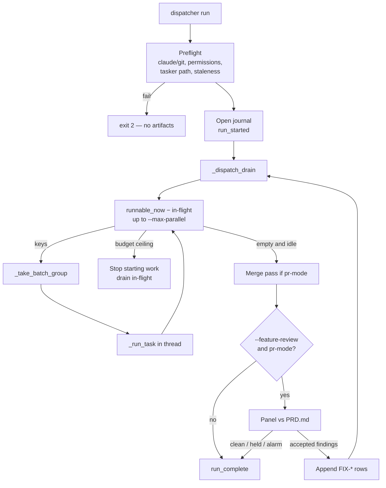
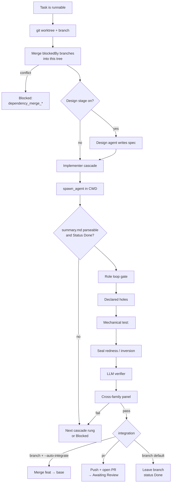
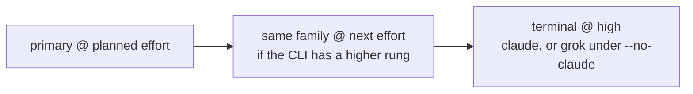
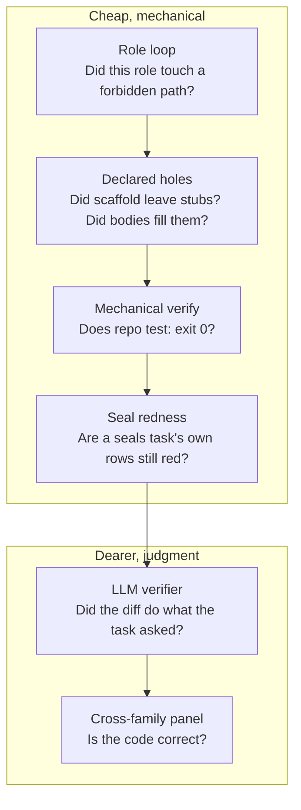
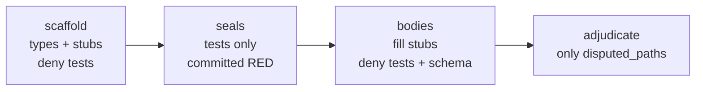
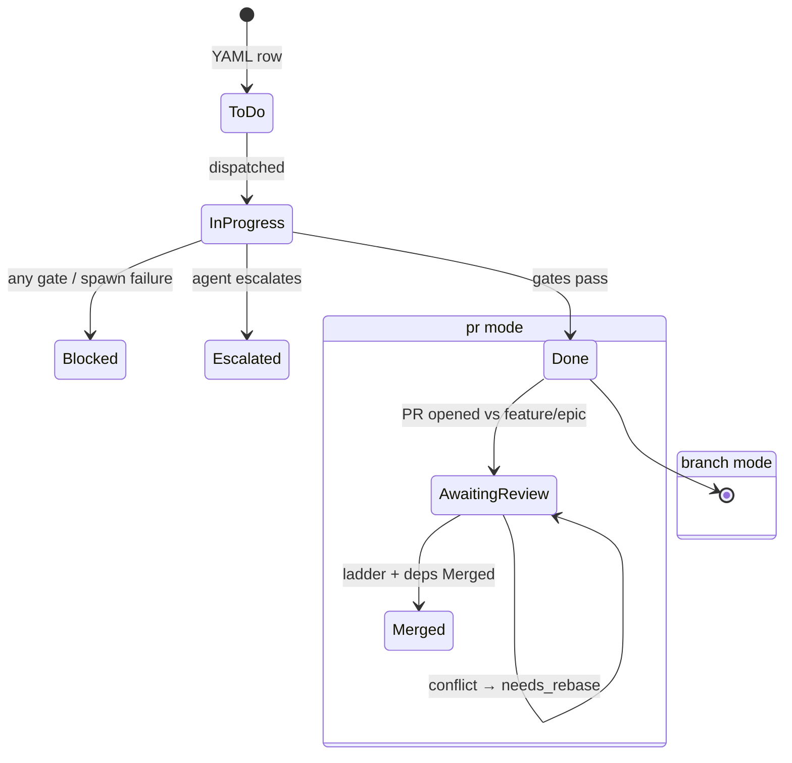
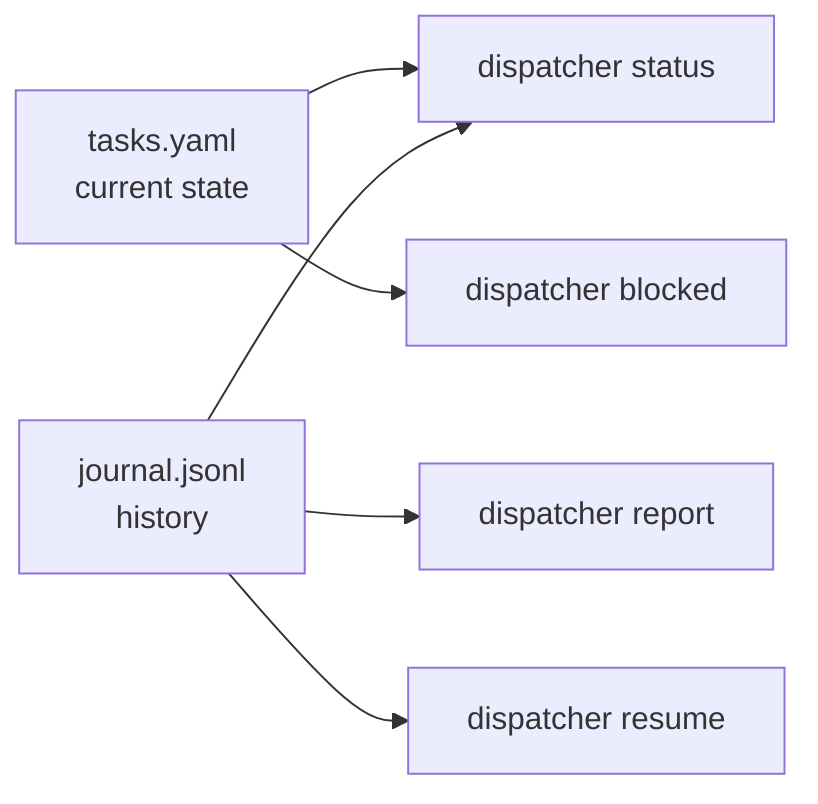
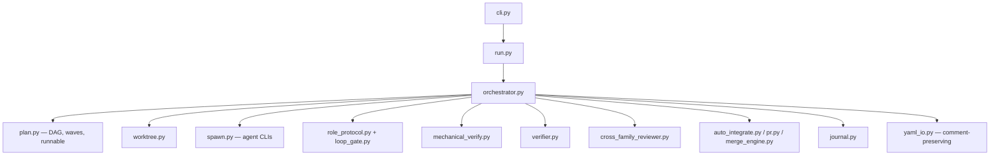

# How the dispatcher works

The dispatcher is a **graph executor with gates**. `tasks.yaml` is the graph.
`orchestrator.py` is the loop. Agents never see the whole epic — they see one
worktree, one brief, and a path to write `summary.md`.

Companion: [architecture/single-orchestrator.md](../architecture/single-orchestrator.md).

---

## 1. The graph

Each row in `tasks.yaml` is a `Task` (`plan.py`). The load-bearing fields:

| Field | What it does |
|---|---|
| `key` | Stable identity (`EPIC-wave-n`). Lands in commit subjects as `[KEY]`. |
| `blockedBy` | Edges. A task is runnable only when every dependency is far enough along. |
| `labels` | Must include `size:XS\|S\|M\|L\|XL`. Risk tokens (`critical`, `security`, `financial`, `high`) raise quality floors. |
| `role` | Optional build-protocol phase (`scaffold` / `seals` / `bodies` / `adjudicate`). Absent → `legacy`. |
| `agent` / `effort` | Who implements, and how hard. Unpinned → run-level default. |
| `verify` / `panel` | Quality intensity. Unpinned → floors from risk/size. |
| `batch_id` | Co-runnable siblings share one worktree and one session. |

`blockedBy` is not storytelling. An edge exists only if the dependent **needs
code or contracts** from the dependency to compile or test. Cycles are
refused at load.



The planner **simulates** this as waves: pretend each runnable task lands
`Done`, recompute, repeat (`plan.plan_waves`). That is what `--mode dry-run`
prints. The live loop is the same idea, recomputed every time a worker
finishes — a dependency unlocking mid-run starts the next wave immediately.



**Dispatch vs merge.** In `integration: branch`, a dependency must be `Done`
before dependents spawn. In `integration: pr`, `Done` / `Awaiting Review` /
`Merged` all satisfy *dispatch* (commits exist and are merged into the
dependent's worktree). *Merge* of PRs is stricter: every `blockedBy` must
already be `Merged`. Seals tasks in pr-mode are a further narrowing — they
must be `Merged` before anyone waiting on them dispatches, because seals are
a review gate, not just code availability.

---

## 2. The run loop

`orchestrator._run_loop` is the only loop. Outer: optional feature-review
rounds. Inner: `_dispatch_drain` until nothing is runnable or in-flight.



Concurrency is a thread pool. Each worker owns a worktree. YAML writes go
through a `FileLock` load-mutate-save cycle. The journal is append-only and
hash-chained — one writer, `fsync` per event.

A heartbeat thread keeps the journal fresh during a long spawn so
`dispatcher resume` can tell a live run from a dead one.

---

## 3. One task, end to end

`_run_task` is the per-key pipeline. Agents do **one** of these boxes
(implement). The dispatcher does the rest.



### Isolation

Each task gets its own worktree (`worktree.py`): sibling
`../worktree-<key>` on a host, or `/worktrees/<key>` in a container. The
branch name follows `type` (`feat/`, `fix/`, …). On `Blocked` the worktree
is **kept** — that is how unfinished work is recovered. On `Done` it is
left for later `git worktree remove` / `dispatcher prune-branches`.

Before the implementer starts, every `blockedBy` branch that is not yet
reachable from `base_branch` is merged into this tree. Dependents build on
real upstream work, not a stale base.

### The implementer is a worker

Every family gets the same brief (`spawn.IMPLEMENTER_PROMPT_TEMPLATE`):

- work only in CWD
- do not adopt Tasker
- do not open PRs
- commit with `[TASK-KEY]` in the subject
- write `summary.md` to `$SUMMARY_PATH`

The dispatcher copies fields from that summary onto the YAML row. The agent
never writes the YAML.

### Cascade

If the spawn dies, the suite is red, the verifier is incomplete, or the
panel blocks, the dispatcher may try another **rung** — same worktree reset
to the pre-spawn SHA, prior failure prepended to the prompt.

What the code actually does (`_implementer_cascade`), which is narrower
than the older routing-policy essay:



Pinned `claude` stays in family (maybe an effort bump on HARD tasks).
`--stay-in-family` drops the terminal switch. `--pin-effort` drops the
effort bump. A role-loop violation does **not** cascade: that would reset
the tree a human needs to read.

---

## 4. The gate stack

Each gate answers a **different question**. Cheapest first. A later gate
never runs on a tree a cheaper gate already rejected.



| Gate | Question | Typical block reason |
|---|---|---|
| Role loop | Did this branch touch a path its `role:` forbids? | `role_diff_loop_gate` — needs `--enable-role-loop-gate` or the rules are documentation |
| Declared holes | Scaffold left `NotImplementedError` at each planned hole? Bodies filled them? | named hole failure |
| Mechanical | Repo `.dispatcher.yaml` `test:` exits 0? | `mechanical_verification_failed` |
| Seal redness | For `role: seals`, are *this task's* rows red? | abstains (`UNJUDGED`) rather than inventing green |
| LLM verifier | Did the committed diff satisfy the task text? | `verification_incomplete` |
| Cross-family panel | Independent families: is it *correct*? | `cross_family_panel: …` |

Verifier `VERIFIED` + panel `block` is not a contradiction. Completeness ≠
correctness. Expect that combination on hard tasks.

**Quality floors** (`quality_levels.py`): explicit `verify:` / `panel:` on
the row win; otherwise risk/size set a floor the design stage may raise but
not sink.

| Risk | Default verify | Default panel |
|---|---|---|
| critical (`critical` / `security` / `financial`) | `llm_strict` | `full` |
| high | `llm` | `full` |
| medium | `llm` | `auto` |
| low | `mechanical` | `never` |

Path evidence may only **add** a panel, never remove one. A wallet file
touched by a task labelled `size:S` still gets reviewed.

---

## 5. Roles: the build protocol

A row with no `role:` is `legacy` — unrestricted, pre-protocol behaviour.
For anything where a wrong test would be expensive, use the four-role chain.



The split exists so the author of the code is not the author of the test
that blesses it. That circular oracle produced 24 vacuous seals here and
let a Critical money bug through elsewhere.

Plan-time refusals (errors, not warnings):

- a `bodies` row with no `seals` edge (`PO-2`)
- an `adjudicate` row with no scaffold/seals/bodies edge, or no `disputed_paths`
- an override that *narrows* a deny list
- `disputed_paths` naming a floored path

The **floor** is a set of globs **no** role may write — the gate code and
the delegation closure of its decisions. A unit whose deliverable *is* a
floored path cannot be completed by any dispatched role; plan an unfloored
module plus an operator transcription row.

Between seals merging and bodies merging the suite is red **by design**.
`config/known-red.yaml` hides those rows from every gate except the body
task's. The file itself is on the floor — an operator writes it, not an
agent.

Deep dive: [new-project-setup.md](../new-project-setup.md) §§3–6.

---

## 6. Integration modes



**Branch mode** (default): each worktree forks from `--base-branch`.
`--auto-integrate` merges `Done` onto base *before* flipping the YAML, so
dependents see the merge. Without it, `Done` means “the branch exists for a
human.”

**PR mode** (`--integration pr` or `integration: pr` in `.dispatcher.yaml`):

1. Run start creates `feature/<epic>` from base.
2. Task worktrees fork from the feature branch.
3. Gates pass → dispatcher pushes and opens a PR against the feature branch
   → `Awaiting Review`. Raising is unconditional; **merging** is gated.
4. Merge pass walks `Awaiting Review` in topological order. A PR merges only
   when the [approval ladder](../../README.md#approval-ladder) is satisfied
   **and** every `blockedBy` is already `Merged`.

Low-risk PRs: dispatcher self-approves. Elevated: wait for an external
GitHub approval. The classifier lives in `.dispatcher.yaml` `risk:` —
effective diff size, forbidden paths/labels. It fails closed.

The dispatcher never auto-rebases a conflict. It stamps `needs_rebase: true`
and continues. `dispatcher merge-prs <run-id>` is the next-morning catch-up.

---

## 7. What a run leaves behind

```
<runs-dir>/<run-id>/
  journal.jsonl          hash-chained events (the run, for machines)
  run.log                human log (fallback liveness only)
  <TASK-KEY>/
    summary.md           implementer's evidence
```

The tasks YAML is the **authoritative per-task state** (status, costs, gate
stamps, `blocked_reason`). The journal is the **authoritative history**
(every spawn, including retries the YAML row overwrites). `dispatcher
status` / `report` / `resume` read both. Spec: [journal-format.md](../journal-format.md).



---

## 8. Where the code lives



Root [README.md](../../README.md) is the CLI reference. This page is the
map; that file is the flag list.
