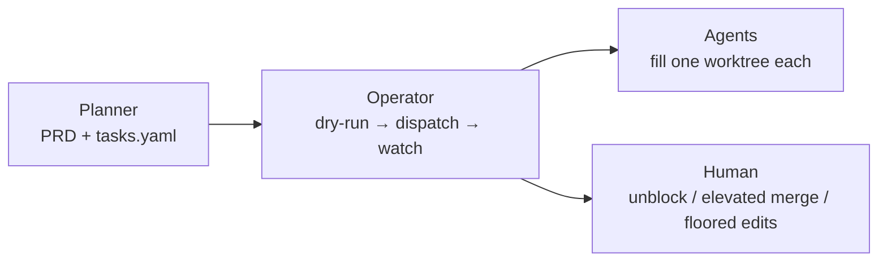
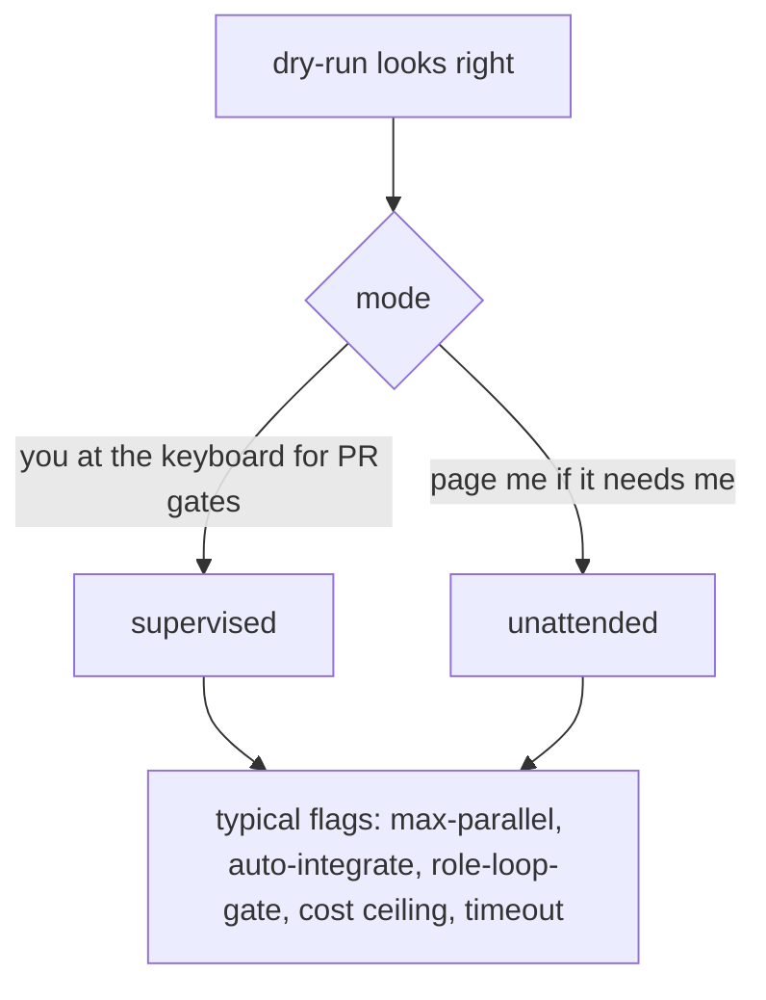
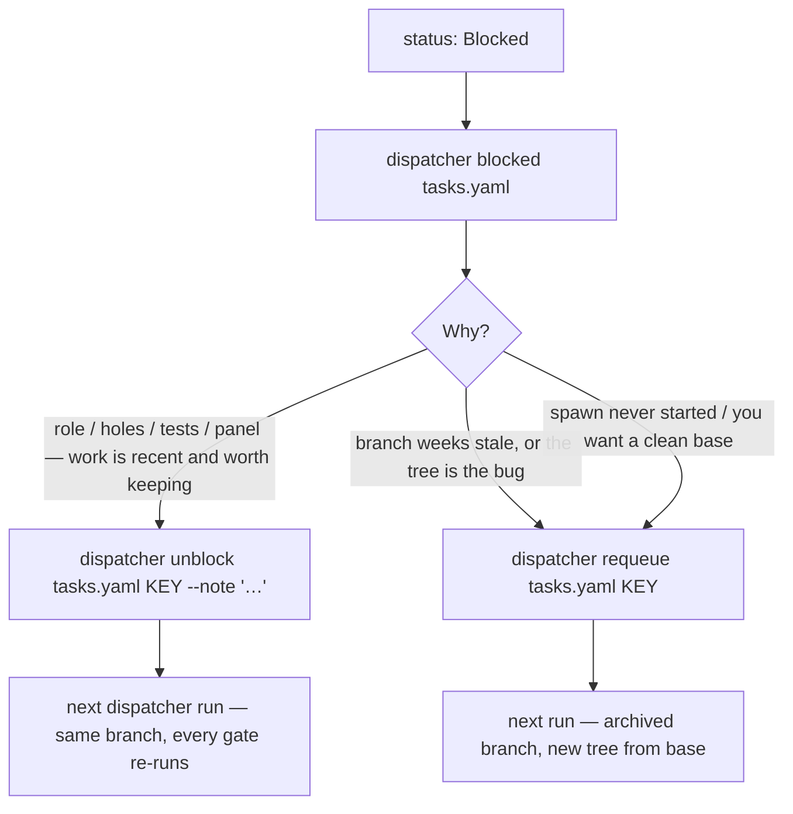
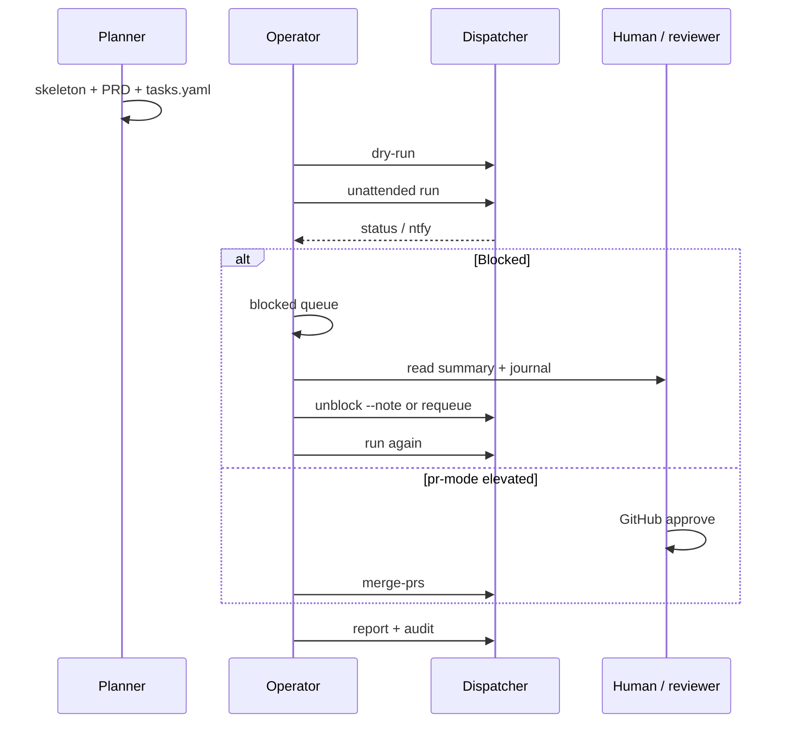

# How to use the dispatcher

A first trusted run, then the loop you live in. Flag-level detail stays in
the root [README.md](../../README.md). Machine install is [SETUP.md](../../SETUP.md).
Repo wiring (`.dispatcher.yaml`, roles, known-red) is
[new-project-setup.md](../new-project-setup.md).

---

## 0. Who does what



Do not mix planner and implementer in one session. A plan the dispatcher
cannot execute wastes more money than a missing CLI flag.

---

## 1. Machine

```bash
# Install the CLI (editable if you work on the dispatcher itself)
pipx install --editable /path/to/claude-dispatcher   # or: pip install -e ".[dev]"

dispatcher doctor --check          # what's installed
dispatcher init                    # what actually works (spends a little quota)
```

`doctor` answers “is the binary on PATH?”. `init` answers “can this account
complete a round trip?” — logged-out and over-quota CLIs look green to
`doctor` and fail at spawn.

You need at least one implementer CLI (`claude` by default; `grok` is
enough for `--no-claude` fleets) and `git`. `gh` is required for pr-mode.
Panel seats (`agy`, `codex`, …) are optional until you turn the panel on.

Unattended Claude runs must pass a real permission bypass or every session
stalls on the first tool call:

```bash
--claude-extra-args "--permission-mode bypassPermissions --allow-dangerously-skip-permissions"
```

`--allow-dangerously-skip-permissions` **alone does not count** — preflight
refuses it. Preferred long-term: an allowed-tools list in
`~/.claude/settings.json`, scoped to the project.

TypeScript repos: fetch the pinned parser once after install, or `.ts`
branches come back `HELPER_MISSING` (blocking, not “no TS support”):

```bash
python3 -m claude_dispatcher.ts_parser_vendor
```

---

## 2. Product repo

Minimum that is not a toy:

| File | Purpose |
|---|---|
| `.dispatcher.yaml` | `test:` command (the mechanical gate). `runs_dir` **outside** the repo. Optional `panel:` / `integration:` / `risk:`. |
| `.agent/risk-paths.json` | Tracked on the **base branch**. Absent → every path is unmatched → fail-closed **high** risk → full panel on everything. |
| `features/<epic>/PRD.md` | Intent oracle for `--feature-review`. |
| `features/<epic>/tasks.yaml` | The graph. |
| `config/known-red.yaml` | Only if you run the role protocol across a red-seals window. |

`dispatcher init --write` will create a starter `.dispatcher.yaml` and
risk table if they are absent; it never overwrites.

Point `runs_dir` **out of the repo** (`../dispatcher-runs`). `docs/runs/`
inside a disposable worktree dies with that worktree.

A worktree is a fresh checkout: gitignored deps (`node_modules`, `.venv`)
are not there. Your `test:` command must provision them, or every task
fails the mechanical gate before a single assertion runs.

---

## 3. Author the graph, then dry-run

Planner playbook: [how-to-author-tasks.md](../how-to-author-tasks.md).
Paste prompt: [templates/planner-prompt.md](../templates/planner-prompt.md).

Always:

```bash
dispatcher run features/<epic>/tasks.yaml --mode dry-run
```

You want: waves that match the seams, parallel width that is real (not
five tasks on one hot file), no cycle, every row a `size:` label and an
**Acceptance** line. Dry-run creates no worktrees and writes no YAML.

Role chains: read [new-project-setup.md](../new-project-setup.md) §§3–4
before you write `role:`. A list authored from the README alone produces
`legacy` rows — they run, with none of the scaffold/seals/bodies
enforcement.

---

## 4. Dispatch



A production-shaped invocation:

```bash
dispatcher run features/<epic>/tasks.yaml \
  --mode unattended \
  --max-parallel 2 \
  --auto-integrate \
  --enable-role-loop-gate \
  --base-branch main \
  --max-cost-usd 200 \
  --task-timeout-seconds 7200 \
  --claude-extra-args '--permission-mode bypassPermissions --allow-dangerously-skip-permissions'
```

For a feature branch + GitHub review surface, add:

```bash
  --integration pr --feature-branch feature/<epic> --feature-review
```

| Flag | Why it is not optional in real runs |
|---|---|
| `--enable-role-loop-gate` | Without it, `role:` is documentation. |
| `--max-cost-usd` | Stops *starting* work at the ceiling; in-flight drains. |
| `--task-timeout-seconds` | Default is 4h. Measure: median spawn ~5 min, long successes ~30 min. A too-low wall kills a task that already committed. |
| `--max-parallel` | A suite with an out-of-process dependency does not parallelise for free. |
| `--auto-integrate` | Branch mode only. Dependents otherwise wait on a human merge. |

`--only KEY1,KEY2` and `--filter size:M,area:schema` restrict the set.
`--skip-verification` skips the LLM verifier (mechanical still runs) and
is journaled; use it as an escape hatch, not a habit.

---

## 5. Watch

Watch the YAML `status:` fields and `dispatcher status`, not a terminal
tail.

```bash
dispatcher status <run-id> --tasks-yaml features/<epic>/tasks.yaml
dispatcher report --tasks-yaml features/<epic>/tasks.yaml
dispatcher blocked features/<epic>/tasks.yaml    # exit 3 if anything Blocked

# live event stream
tail -F ../dispatcher-runs/<run-id>/journal.jsonl | jq -c '{seq, event_type, task_key}'
```

Optional: `--ntfy-topic …` or `DISPATCHER_SLACK_WEBHOOK` so a block pages
you. Events: `task_blocked`, `awaiting_pr_approval`, `run_complete`,
`worker_exception`.

Interrupted host:

```bash
dispatcher resume <run-id>            # In Progress → re-dispatch; terminal rows untouched
dispatcher resume <run-id> --force    # only if you know the original process is dead
```

---

## 6. When a task blocks

Blocked is the only stop state. Nothing auto-retries it — not `resume`,
not the next wave. Measure first. Early dogfood blocks were often
**dispatcher** defects; unblocking without reading discarded correct work.



```bash
dispatcher blocked features/<epic>/tasks.yaml
dispatcher unblock features/<epic>/tasks.yaml U-3 --note "keep helper.go; delete debug.log"
dispatcher requeue  features/<epic>/tasks.yaml U-3
```

- `--note` is appended to the **task description permanently** and the
  re-spawned agent reads it. Put a real adjudication there, or omit it.
- Never `--all` when rows are Blocked for different reasons.
- Unblock **keeps** the branch. Requeue **archives then deletes** it
  (`archive/<KEY>-<date>`). Clearing the `branch:` field by hand does not
  help — the name is derived and the old branch is found again.
- Worktrees on Blocked are preserved on purpose. `git log` reporting
  “nothing” has been a lie more than once; uncommitted work was still in
  the tree.

---

## 7. Land and tidy

**Branch mode:** `--auto-integrate` merges as tasks complete. Otherwise
you merge `feat/…` branches yourself.

**PR mode:** the dispatcher opens PRs. Elevated PRs wait on GitHub
approval. After overnight reviews:

```bash
dispatcher merge-prs <run-id>
```

A conflict stamps `needs_rebase: true` and moves on. Rebase is yours (or
the supervising agent's). The dispatcher will not do it.

After work is on the base:

```bash
dispatcher audit features/<epic>/tasks.yaml --base main
dispatcher prune-branches --base main --pattern feat/          # dry run
dispatcher prune-branches --base main --pattern feat/ --yes
```

`audit` reports Done work that is not reachable from base and has no
merged PR. `prune-branches` deletes local branches whose work *is* on
base — leftover names are future dependency-merge conflicts.

Jira, if you use [forecast](https://github.com/andrewcostello/forecast):

```bash
dispatcher forecast-create features/<epic>/tasks.yaml
dispatcher run …
dispatcher forecast-sync features/<epic>/tasks.yaml
```

Missing forecast is a soft skip (exit 0).

---

## 8. A day in the loop



---

## 9. Common first-run failures

| What you see | Actual cause |
|---|---|
| Every task stalls, then `Done` with nothing committed | Missing permission bypass (preflight should have caught this) |
| `mechanical_verification_failed` on task 1, empty log | `test:` assumes `node_modules` / `.venv` in a fresh worktree |
| Panel on a docs-only change, `risk=high unclassified=N` | No tracked `.agent/risk-paths.json` on the base ref |
| `HELPER_MISSING` on `.ts` | Parser vendor step not run |
| Role violations you thought you configured | Forgot `--enable-role-loop-gate` |
| Dependents never start in branch mode | No `--auto-integrate` and deps are `Done` only on their own branches |
| Unblock → same block on files the agent “didn't touch” | Stale branch hundreds of commits behind; `requeue` |
| Dry-run error about `role:` / `PO-2` | `bodies` row with no `seals` edge — the protocol is working |

---

## 10. Where to go next

| Goal | Doc |
|---|---|
| Write a better graph | [how-to-author-tasks.md](../how-to-author-tasks.md) |
| Turn on roles / known-red / the floor | [new-project-setup.md](../new-project-setup.md) |
| Route cheap vs hard agents | [agent-routing-policy.md](../agent-routing-policy.md) |
| Batch siblings | [task-batching.md](../task-batching.md) |
| Feature-level PRD review | [feature-review-loop.md](../feature-review-loop.md) |
| Dogfood this repo with Grok | [dogfood/GROK_OPERATOR.md](../dogfood/GROK_OPERATOR.md) |
| Every flag | [README.md](../../README.md) |
