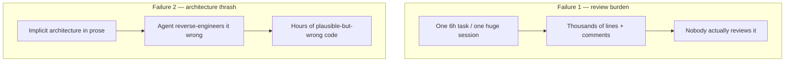
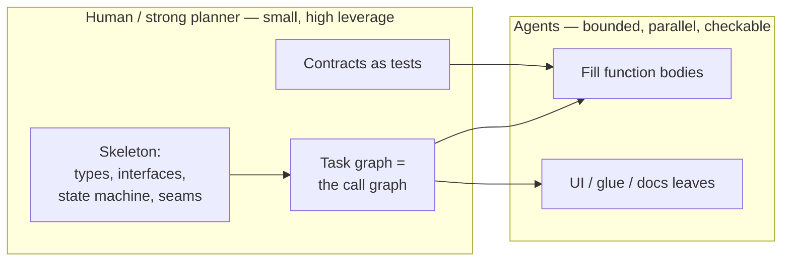
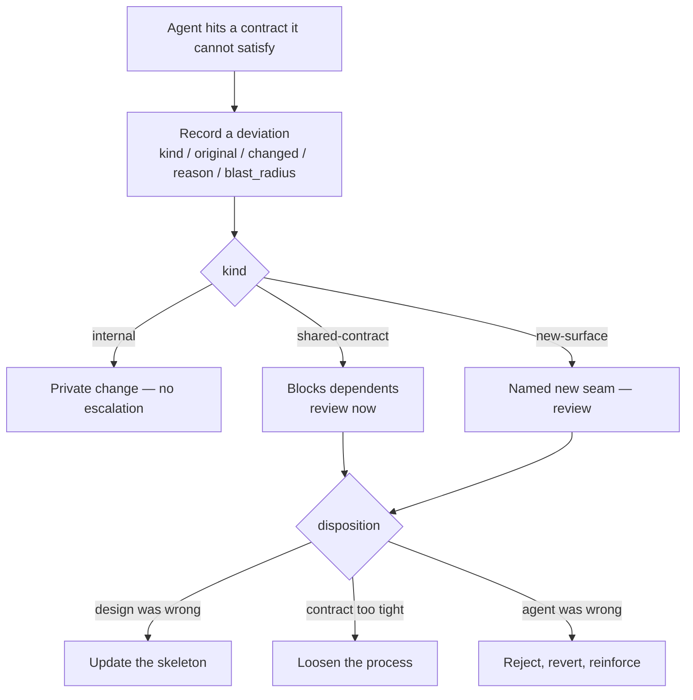
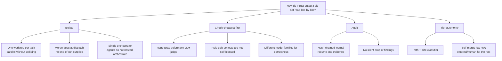

# Why the dispatcher works

This is not “the recommended way to use an agent.” It is the answer this
repo reached for a specific problem: **run many autonomous agents on one
feature without reading every line they write**, in a setting where
auditability matters.

The transferable heuristic: **match autonomy to checkability.** The
dispatcher industrializes that. If your constraints differ, steal the
pieces that fit.

The talk-length version is [presentation-outline.md](../presentation-outline.md).

---

## The problem

A capable agent is a fast, literal collaborator with **no standing memory
of your intent**. It is astonishing and confidently wrong in the same
breath. Two working styles scale throughput — autonomous loops, and
parallel fan-out — and both fail the same way at feature scale:

Those are not hypothetical. Unreviewable volume showed up as tournament-BSA
diffs nobody could sign. Architecture thrash showed up as a live-e2e run
that confused legacy vs new systems for hours, with a prose
`CORRECTED-MODEL.md` that got under-read.

A third, quieter failure: **the circular oracle**. The same session writes
the code and the test that blesses it. This repo measured 24 vacuous seals
from exactly that shape, and it is the shape that let a Critical money bug
through (SMG-3966).

---

## The bet

Flip who authors what.

- You review the **skeleton** (a fraction of the volume, nearly all the
  design) and **skim conforming bodies**.
- “Done” for a leaf is **make this test pass** — objective, so a cheaper
  model can do the bulk.
- Wandering off the architecture becomes a **type error**, not a 6-hour
  spiral.
- The graph is **derived** from seams, not guessed as story points.

That is the contract-first experiment documented in
[contract-first-deviation-model.md](../contract-first-deviation-model.md)
and enforced (when you opt in) by `role:` in
[new-project-setup.md](../new-project-setup.md).

---

## Deviations keep it from being a religion

Pure contract-first is too rigid. The human's architecture is often wrong,
and the agent hitting reality is who discovers it.

**An agent may change a contract if it records a deviation.** Conformance
is the default; deviation is a logged, reviewed exception. That log is the
highest-signal review surface — every entry is where design met the world.

Three anti-drift rules:

1. **Type by blast radius.** Internal = free. Shared = gated.
2. **Deviation costs an escalation.** A cheap model fills silently;
   wanting to change a shared type bumps to a stronger model or a human.
3. **Deviation *rate* is an alarm.** Many deviations ⇒ under-designed
   skeleton ⇒ redesign, don't patch.

Honest limit: correctly-contracted functions can still be wrong *together*.
Seam / e2e contracts remain load-bearing. Weak tests still let
subtly-wrong-but-green code through.

---

## Why each mechanical choice exists

Every box in [how-it-works.md](./how-it-works.md) is a scar or a
constraint, not an aesthetic.

### Isolated worktrees

Parallel agents on one working copy will overwrite each other. A worktree
per task is isolation you can `git` at. Dependency merge at dispatch is so
wave 2 actually compiles against wave 1, instead of discovering the seam at
the feature-branch merge.

### Single orchestrator

Stacking Tasker (an in-session orchestrator) under the dispatcher creates
two loops, double review, and unfair agent comparisons (Claude “thick”
path vs everyone else thin). Quality for batch work belongs in **gates**,
not in re-implementing a manager inside the model.
[architecture/single-orchestrator.md](../architecture/single-orchestrator.md).

### Mechanical first, LLM second

A red suite makes an eloquent verifier irrelevant. The mechanical gate is
the repo's own `test:` command, exit code only — it never parses test
output (a ruling: parsers of test output become a second, drifting
oracle).

The LLM verifier exists for a different bug: **passed the tests, did not
do the task** (stubs, quietly narrowed scope). It produces a gap list and
re-spawns, bounded. It is a completeness judge, not a code reviewer.

A real scar: the verifier once produced seven truncation false-positives
on a huge diff. That is a reason to **shrink what the judge must read**
(contract-first), not to skip the judge.

### Cross-family panel

In-cycle reviewers that share the implementer's family share its blind
spots. A Claude/Gemini/Codex panel is an additional net. All authoritative
seats must `APPROVE`; a single dissent or any CRITICAL/HIGH finding
blocks. Advisory seats (e.g. grok) report and cannot block — they exist to
build a scorecard before a human promotes them.

### Role protocol

Honour-system “don't write the tests for your own code” is what produced
the vacuous seals. `role:` makes the prohibition **expressible and
enforced** at plan time and at diff time. `--enable-role-loop-gate` is
required for the diff-time half; without it the roles are comments.

### Known-red register

Seals are *supposed* to be red until the body lands. Without a register,
every other task in that window fails a gate it cannot satisfy and pays a
fix-the-tests spawn that cannot help. The register fails toward red: a
misspelled entry deselects nothing.

### Risk-matched landing

Not every change deserves a human. Effective diff size (tests and
generated code excluded from the *count*, not from the ship) plus a path
denylist route low-risk work to self-merge and elevated work to an
external reviewer. Autonomy is earned by how cheaply you can check.

### Journal

For a run you may need to explain later: what spawned, what the panel
said, what was skipped. A hash chain is tamper-evident and is what
`resume` reconstructs from. `run.log` is for humans; do not parse it.

### Notifications instead of polling

A run that needs a human and does not page you will sit for a day. That
happened. ntfy/Slack are one-way push; walking back to the laptop is still
how supervised gates are answered.

---

## What this does *not* buy you

- **A substitute for a good skeleton.** Weak contracts produce
  green-and-wrong bodies. Authoring the skeleton is expert work — it is
  also the right place to spend a human.
- **Emergent correctness.** Seam tests and a feature-level PRD review
  (`--feature-review`) exist because unit-green ≠ feature-true.
- **Infinite cheap parallelism.** `--max-parallel` is bounded by the
  suite's out-of-process dependencies, quota, and merge conflicts on shared
  files. Waves that all edit one hot file are a planning bug.
- **A waiver.** `dispatcher unblock` retries; it does not skip gates.
  `--skip-verification` / `--skip-preflight` are journaled because they are
  the thing an auditor will ask about.

---

## The throughline

> Design the system so correctness is cheap to check, then let the agent
> fill it in.

Even if you never run this CLI, the pieces travel: make “done” objective,
match autonomy to checkability, review the design not the diff, keep an
audit trail. Use them in a pairing session or a 40-task epic.
